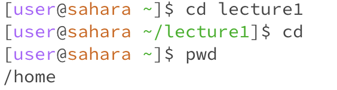
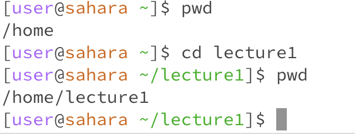
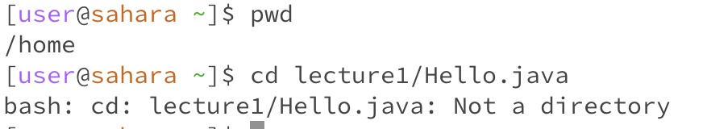
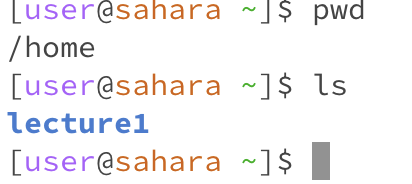
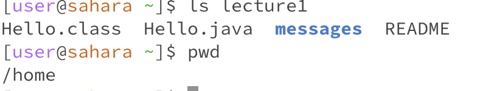
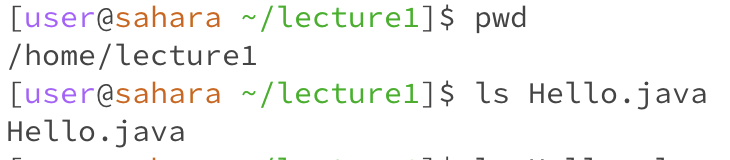
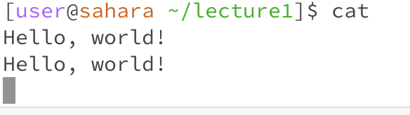
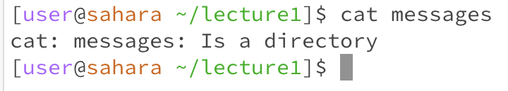
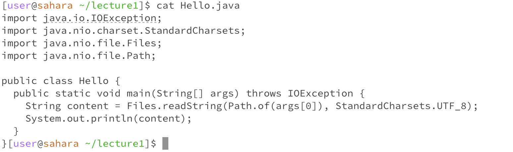

`cd`

The original working directory before the command was run was `/home/lecture1`, and the working directory after the command was run was `/home`
When the `cd` command has no arguments, it takes you to the `/home` directory, which is why the working directory was `/home` after the command was run. 
The output is not an error.

`cd lecture1`

The original working directory before the command was run was `/home`, and the working directory after the command was run was `/home/lecture1`.
The working directory after the command was run was `/home/lecture1` because we used this command to change the directory from the `/home` directory to `/home/lecture1`.
The output is not an error.

`cd lecture1/Hello.java`

The working directory when the command was run was the `/home` directory.
The output was `bash: cd: lecture1/Hello.java: Not a directory` because when we use `cd` followed by something, the thing that follows the command has to be a directory, not a file. This is because you are changing into a different working directory.
The output is an error because you are supposed to put a path to a directory to change into after the `cd` command, but instead we put a path to a file.

`ls`

The working directory is `/home`.
The output is `lecture1` because the command `ls` without arguments lists the items in the current working directory, and the only item in the current working directory (the `/home` directory in this case) is the `/home/lecture1` directory.
The output is not an error.

`ls lecture1`

The working directory is `/home`.
The output is the items in the `/home/lecture1` directory because the command `ls lecture1` lists the items in the directory that is named after `ls` (in this case the directory named is `/home/lecture1`).
The output is not an error.

`ls Hello.java`

The working directory is `/home/lecture1`.
The output is `Hello.java` because we are using the command `ls Hello.java` to list the file name for us, which is `Hello.java` in this case. When you type a path to a file name after `ls`, you get the name of the file.
The output is not an error. 

`cat`

The working directory is `/homelecture1`.
The output is `Hello, world` because when you type the `cat` command without arguments it just prints out what you type in as the input, which was `Hello, world` in this case.
The output is not an error.  

`cat messages`

The working directory is `/home/lecture1`.
The output is `cat: messages: Is a directory` because the `cat` command with an argument should have a file path after it, so that the contents of the file can be printed out. In this case, we put a directory path after the `cat` command rather than a file path.
The output is an error, and it is an error because the `cat` command with an argument expects a file path to print out the contents of, but we put a directory path instead. 

`cat Hello.java`

The working directory is `/home/lecture1`.
The output is the contents of the `Hello.java` file because when we put a file path after the `cat` command, the contents of the file are printed.
The output is not an error. 

