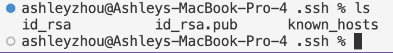

Lab Report 2

Part 1

```
import java.io.IOException;
import java.net.URI;

class Handler implements URLHandler {
    String result = "";

    public String handleRequest(URI url) {
        if(url.getPath().contains("/add-message")) {
            String[] parameters = url.getQuery().split("=");
            String message = parameters[1].split("&")[0];
            result+=parameters[2] + ": " + message + "\n";
            return String.format(result);
        }
        return "404 Not Found!";
    }
}

class ChatServer {
    public static void main(String[] args) throws IOException {
        if(args.length == 0){
            System.out.println("Missing port number! Try any number between 1024 to 49151");
            return;
        }

        int port = Integer.parseInt(args[0]);

        Server.start(port, new Handler());
    }
}
```


`handleRequest()` is called. The argument to `handleRequest()` is `URI` url. When the method is initially called, the field `result` is an empty `String`.
The method then concatenates the appropriate message to `result`, and `result` changes from an empty `String` to "jpolitz: Hello".


`handleRequest()` is called. The argument to `handleRequest()` is `URI` url. When the method is initially called, the field `result` is the `String` "jpolitz: Hello".
The value of `result` changes to "jpolitz: Hello" + "\n" + yash: How are you" because the method concatenates "yash: How are you" to "jpolitz: Hello".

Part 2

Absolute path to private key: `/home/linux/ieng6/oce/3f/aszhou`


Absolute path to public key: `/Users/ashleyzhou/.ssh/id_rsa.pub`



Logging in without password:


Part 3

Something I learned from lab is that you can use the scp command to copy files between two systems. This is how we copied the 
absolute path of the public key into our ieng account's file system, so that we could login without
needing to type our password.
