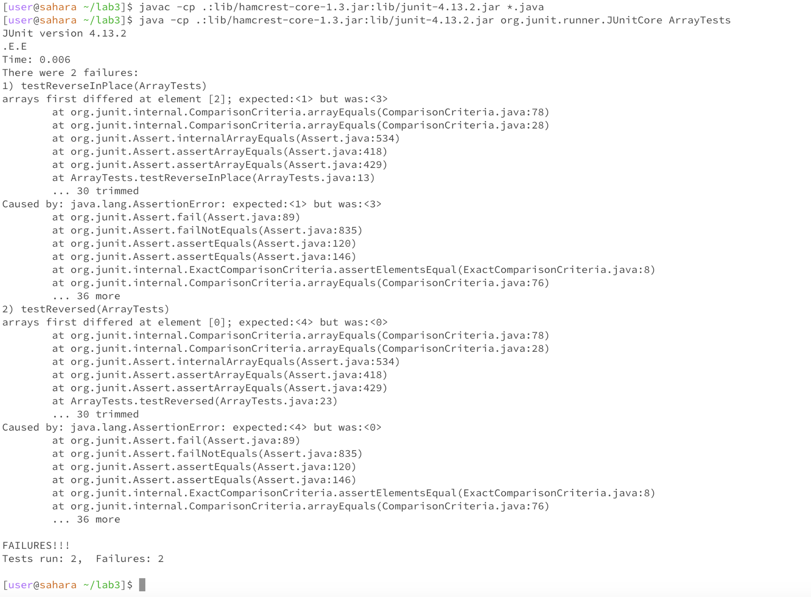

Ashley Zhou
Lab Report 3

Part 1

The program I am choosing is ArrayTests.java. 

Failure inducing input for `reverseInPlace()`:
```
int[] input2 = {1,2,3};
ArrayExamples.reverseInPlace(input2);
assertArrayEquals(new int[]{3,2,1}, input2);
```
Failure inducing input for `reversed()`:
```
int[] input2 = {1,2,3,4};
assertArrayEquals(new int[]{4,3,2,1}, ArrayExamples.reversed(input2));
```
Input that doesn't induce a failure for `reverseInPlace()`:
```
int[] input1 = { 3 };
ArrayExamples.reverseInPlace(input1);
assertArrayEquals(new int[]{ 3 }, input1);
```
Input that doesn't induce a failure for `reversed()`:
```
assertArrayEquals(new int[]{ }, ArrayExamples.reversed(input1));
```
The symptom: 

The bug
Before: 
```
  // Changes the input array to be in reversed order
  static void reverseInPlace(int[] arr) {
    for(int i = 0; i < arr.length; i += 1) {
      arr[i] = arr[arr.length - i - 1];
    }
  }

  // Returns a *new* array with all the elements of the input array in reversed
  // order
  static int[] reversed(int[] arr) {
    int[] newArray = new int[arr.length];
    for(int i = 0; i < arr.length; i += 1) {
      arr[i] = newArray[arr.length - i - 1];
    }
    return arr;
  }
```
After:
```
// Changes the input array to be in reversed order
  static void reverseInPlace(int[] arr) {
    for(int i = 0; i < arr.length/2; i += 1) {
      int temp = arr[i];
      arr[i] = arr[arr.length - i - 1];
      arr[arr.length - i - 1] = temp;
    }
  }

  // Returns a *new* array with all the elements of the input array in reversed
  // order
  static int[] reversed(int[] arr) {
    int[] newArray = new int[arr.length];
    for(int i = 0; i < arr.length; i += 1) {
      newArray[i] = arr[arr.length - i - 1];
    }
    return newArray;
  }
```
For `reverseInPlace()`, I changed the for loop to only iterate through half the array, and 
I changed the body of the loop to have it swap the current element and the corresponding
symmetrical element in the array. This fixes the issue of the elements in the array being 
mirrored, rather than reversed (as the array is supposed to be reversed). 
For `reversed()`, I changed the body of the loop to have it assign the elements of the 
original array to the new array, and I also changed it to return the new array. This fixes
the problem of having the values of the original array be reassigned (rather than the new
array), and it also fixes the problem of returning the original array, as it is supposed
to return a new array with the elements of the original array reversed.

Part 2

Option 1: `less -N`
Command: `biomed % less -N rr73.txt`
Output (first 10 lines):
```
      1 
      2   
      3     
      4       
      5         Introduction
      6         Three-dimensional (3D) collagen gel culture has been
      7         used as an 
      8         in vitro model of 
      9         in vivo tissue contraction, a common
     10         feature of fibrosis, as well as the resolution of
```
