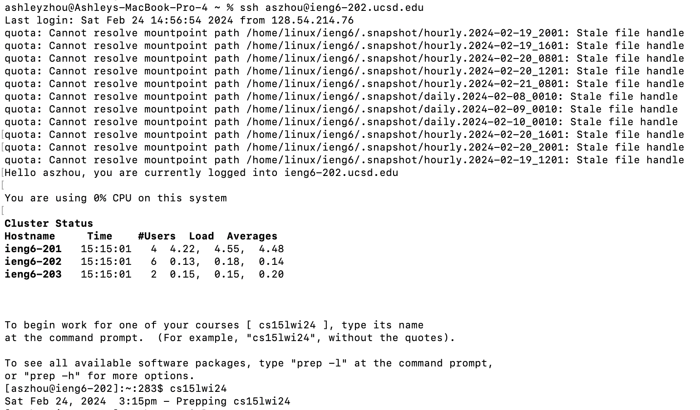
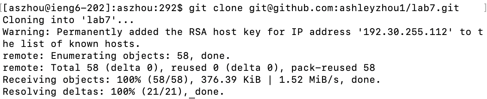
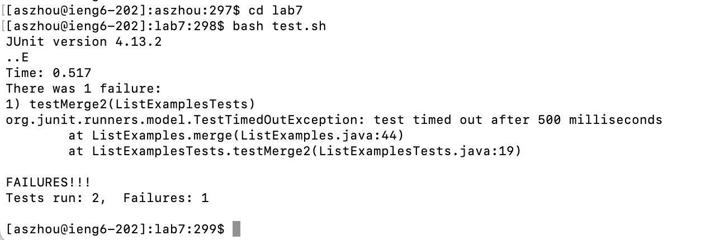
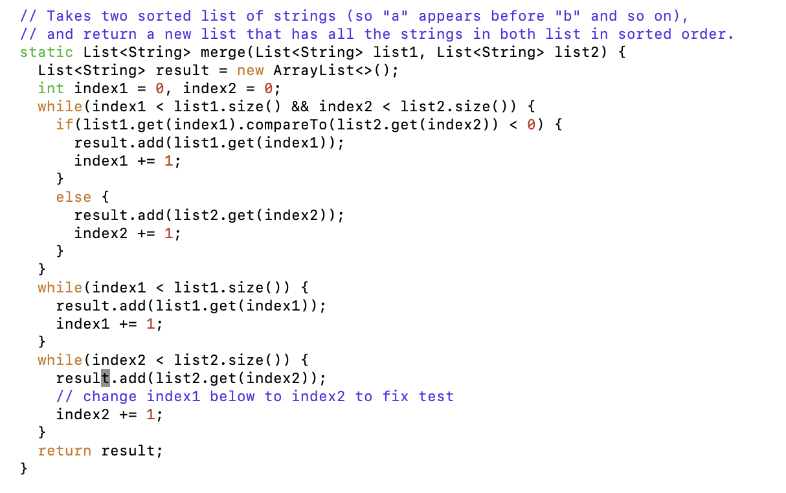
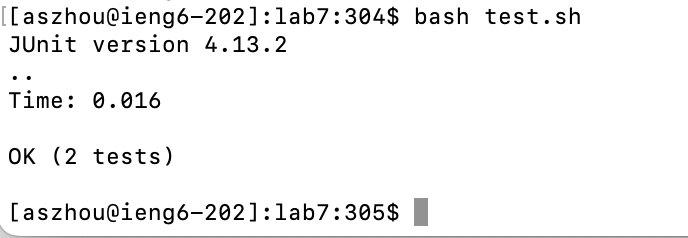
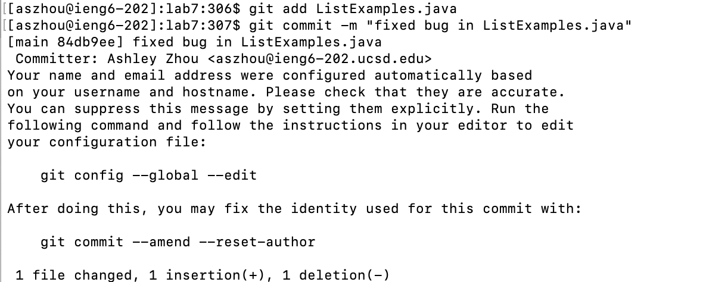
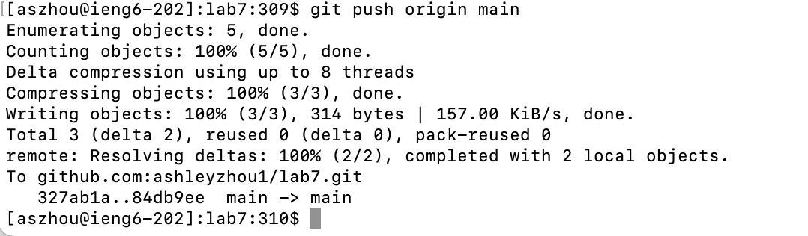

Lab Report 4

Step 4

Keys/commands:
`ssh aszhou@ieng6-202.ucsd.edu`
`<enter>`
`cs15lwi24`
`<enter>`
I just typed out the commands.

Step 5

Keys typed/commands:
`git clone git@github.com:ashleyzhou1/lab7.git`
`<enter>`
`git clone` clones the existing repository.
I just typed out the commands,

Step 6

Keys typed/commands:
`cd lab7`
`<enter>`
`bash test.sh`
`<enter>`
I just typed out the commands.

Step 7

Keys typed/commands:
`vim ListExamples.java`
`<enter>`
`i`
`<down arrow>`
`<right arrow>`
`<right arrow>`
`2`
`<esc>`
`:`
`x`
`<enter>`
I just typed out all the keys. Typing `i` put me in insert mode for vim, and `<down arrow>`, `<right arrow>`, `<right arrow>` allowed me to navigate to the spot I wanted to edit in `ListExmaples.java`.  `<esc>` lets me escape insert mode and `:x` saves and exits.

Step 8

Keys typed/commands:
`<up arrow>`
`<up arrow>`
`<enter>`
The `bash test.sh` command was two up in my history, so I used the `<up arrow>` to access it. 

Step 9

Keys typed/commands:
`Ctrl-R`
`add`
`<enter>`
`Ctrl-R`
`commit`
`<enter>`
`Ctrl-R`
`push`
`<enter>`
The first `Ctrl-R` searched my command history for `add`, which I used to find the `git add ListExamples.java` command. The second `Ctrl-R` searched my command history for `commit`, which I used to find the `git commit -m "fixed bug in ListExamples.java"` command. The third `Ctrl-R` searched my command history for `push`, which I used to find the `git push origin main` command. 

